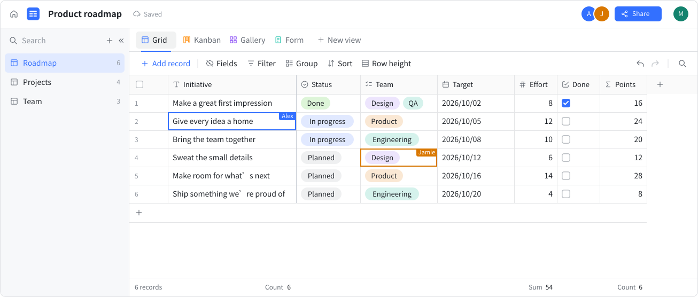

<p align="center">
  <picture>
    <source media="(prefers-color-scheme: dark)" srcset="assets/logo-dark.svg">
    
  </picture>
</p>

<p align="center"><strong>Yet another collaborative spreadsheet.</strong></p>

<p align="center">
  <a href="README.zh-CN.md">简体中文</a> ·
  <a href="https://sayrud.com/">Official Site</a> ·
  <a href="https://docs.sayrud.com">Documents</a> ·
  <a href="https://docs.sayrud.com/blog">Blog</a> ·
  <a href="docs/swagger.yaml">API</a>
</p>

<p align="center">
  <picture>
    <source media="(prefers-color-scheme: dark)" srcset="assets/product-preview-en-dark.svg">
    
  </picture>
</p>

## ✨ Features

Sayrud is a self-hosted collaborative spreadsheet database for organizing projects, tasks, and shared data.

- Grid, kanban, gallery, and form views over the same table.
- Text, number, date, single-select, multi-select, checkbox, attachment, and formula fields.
- Custom JavaScript field shortcuts published by admins. They regenerate automatically when the referenced fields change.
- Each view has its own filters, sorting, grouping, and visible fields.
- Edit together in real time and see who is online and which cells they are editing.
- Copy and paste cells, edit records in batches, and undo or redo changes.
- Configurable OAuth2, OIDC, and SAML single sign-on, and LDAP authentication, with provider templates for GitHub,
  Google, Microsoft, Keycloak, and more.
- Localized interface and system messages in ten languages.
- Light, dark, and system themes.
- REST API with an [OpenAPI specification](docs/swagger.yaml).

## 🚀 Deployment

You need Docker and Docker Compose 2.23.1 or later. The image includes both the frontend and backend. Compose starts
Sayrud, PostgreSQL, and Redis together.

For production, set `POSTGRES_PASSWORD` in a local `.env` file before the first startup. The default password,
`change-me`, is for local use.

```sh
git clone https://github.com/sayrud/sayrud.git
cd sayrud
docker compose up -d
```

Open <http://localhost:2830> and sign up with an email and password. The first registered account becomes a system
administrator. Data is stored in the `postgres_data` volume.

To update:

```sh
docker compose pull
docker compose up -d
```

## 🤝 Contributing

Bug reports and pull requests are welcome. Include steps to reproduce bugs, and keep each pull request focused on one
change.

For development, you need Go 1.27, Node.js 22.13 or later, and pnpm 10. The Go backend is in `cmd/` and `internal/`, and
the Vue and TypeScript frontend is in `frontend/`.

Start only the databases and copy the local configuration. Build the frontend once before running Go commands:

```sh
docker compose up -d --wait postgres redis
cp config/sayrud.example.yaml config/sayrud.yaml
pnpm --dir frontend install --frozen-lockfile
pnpm --dir frontend build
REDIS_ADDRESS=127.0.0.1:6379 go run ./cmd/sayrud-server
```

If you change `POSTGRES_PASSWORD`, use the same password in the PostgreSQL connection in `config/sayrud.yaml`. Run
`docker compose stop sayrud` if the Compose application is already using port `2830`.

In another terminal, run `pnpm --dir frontend dev` and open <http://localhost:5173>. Vite proxies API and WebSocket
requests to the backend. Production builds embed `frontend/dist` with `go:embed`.

Before submitting a change:

```sh
pnpm --dir frontend lint
pnpm --dir frontend test
pnpm --dir frontend build
go test ./...
```

When API definitions change, run `bash scripts/generate.sh` to update the OpenAPI files and frontend client.

## ⚖️ License

Licensed under [AGPL-3.0](LICENSE).
