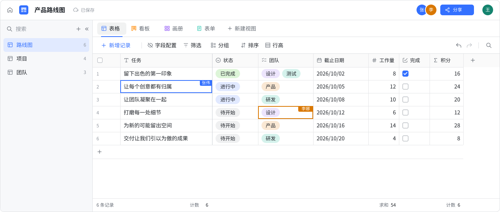

<p align="center">
  <picture>
    <source media="(prefers-color-scheme: dark)" srcset="assets/logo-dark.svg">
    
  </picture>
</p>

<p align="center"><strong>Yet another collaborative spreadsheet.</strong></p>

<p align="center">
  <a href="README.md">English</a> ·
  <a href="https://sayrud.com/">Official Site</a> ·
  <a href="https://docs.sayrud.com">Documents</a> ·
  <a href="https://docs.sayrud.com/blog">Blog</a> ·
  <a href="docs/swagger.yaml">API</a>
</p>

<p align="center">
  <picture>
    <source media="(prefers-color-scheme: dark)" srcset="assets/product-preview-zh-CN-dark.svg">
    
  </picture>
</p>

## ✨ 功能介绍

Sayrud 是一款可以自己部署的协作式多维表格，用来整理项目、任务和共享数据。

- 同一张数据表支持表格、看板、画册和表单视图。
- 支持文本、数字、日期、单选、多选、复选框和公式字段。
- 字段捷径：用任意 OpenAI 兼容模型做分类、打标签、翻译、总结和信息提取，管理员也可发布 JavaScript 自定义捷径；引用字段变化后自动重新生成。
- 每个视图可以单独设置筛选、排序、分组，以及显示或隐藏哪些字段。
- 多人实时编辑，显示在线成员和正在编辑的单元格。
- 复制粘贴单元格、批量编辑记录，支持撤销和重做。
- 可配置 OAuth2、OIDC、SAML 单点登录和 LDAP 身份验证，内置 GitHub、Google、Microsoft、Keycloak 等配置模板。
- 提供十种语言的本地化界面与系统提示。
- 支持浅色、深色和跟随系统的主题。
- 提供 REST API 和 [OpenAPI 描述文件](docs/swagger.yaml)。

## 🚀 部署方式

需要 Docker 和 Docker Compose 2.23.1 或更新版本。镜像包含前后端，Compose 会一起启动 Sayrud、PostgreSQL 和 Redis。

用于生产环境时，首次启动前请在本地 `.env` 文件中设置 `POSTGRES_PASSWORD`。默认密码 `change-me` 仅供本地运行使用。

```sh
git clone https://github.com/sayrud/sayrud.git
cd sayrud
docker compose up -d
```

打开 <http://localhost:2830>，用邮箱和密码注册账号，首次注册的账号会成为系统管理员。数据保存在 `postgres_data` 卷中。

更新镜像：

```sh
docker compose pull
docker compose up -d
```

## 🤝 贡献开发

欢迎提交 Issue 和 Pull Request。报告 Bug 时请附上复现步骤，提交代码时尽量一次只改一个问题。

开发需要 Go 1.27、Node.js 22.13 或更新版本和 pnpm 10。Go 后端在 `cmd/` 和 `internal/`，Vue 和 TypeScript 前端在
`frontend/`。

只启动数据库，复制本地配置，再构建一次前端：

```sh
docker compose up -d --wait postgres redis
cp config/sayrud.example.yaml config/sayrud.yaml
pnpm --dir frontend install --frozen-lockfile
pnpm --dir frontend build
REDIS_ADDRESS=127.0.0.1:6379 go run ./cmd/sayrud-server
```

自定义 `POSTGRES_PASSWORD` 后，需要将 `config/sayrud.yaml` 中的 PostgreSQL 连接密码改为相同值。Compose 应用若占用了 `2830`
端口，先运行 `docker compose stop sayrud`。

另开一个终端运行 `pnpm --dir frontend dev`，打开 <http://localhost:5173>。Vite 会将 API 和 WebSocket 请求代理到后端。生产构建通过
`go:embed` 打包 `frontend/dist`。

提交前运行：

```sh
pnpm --dir frontend lint
pnpm --dir frontend test
pnpm --dir frontend build
go test ./...
```

修改 API 定义后，运行 `bash scripts/generate.sh` 更新 OpenAPI 文件和前端客户端。

## ⚖️ License

采用 [AGPL-3.0](LICENSE) 许可证。
